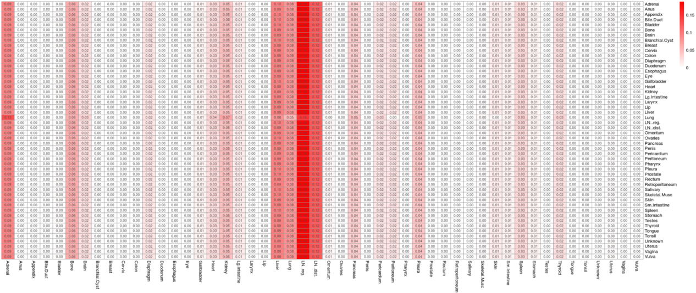

```{r setup}
knitr::opts_chunk$set(echo = TRUE,message = FALSE)
library(markovchain)
library(diagram) 
library(randomcoloR)

```


### Visualizing discrete-time Markov chains using the `markovchain` package


In this example, we'll look at how to visualize the graphical representation of a Markov chain (i.e. in the form of a *weighted directed graph*). Fortunately, there is a package `markovchain` written specifically to handle these kind of tasks, limited to discrete time Markov chain (DTMC). Let's take a look at a simple example here:

```{r, mc1}

# define a transition matrix (row sum needs to be 1)
mc <- matrix(c(0.65,0.25,0.1,
               .25,0.25,.5,
               .35,.25,0.4),nrow = 3, byrow = TRUE)
# define state names
stateNames <- c("A","B","C")

# populate column and row names
row.names(mc) <- stateNames; 

colnames(mc) <- stateNames

# visualize the transition matrix using plotmat (a function from the package 'diagram')
plotmat(mc,pos = c(1,2), 
        lwd = 1, box.lwd = 2, 
        cex.txt = 0.8, 
        box.size = 0.1, 
        box.type = "circle", 
        box.prop = 0.5,
        box.col = c("light blue","light green","yellow"),
        arr.length=.1,
        arr.width=.1,
        self.cex = .6,
        self.shifty = -.01,
        self.shiftx = .14,
        main = "Markov Chain Example")

```


### Calculating joint distribution of a Markov chain 

**R Pre-requisites**:

- *Multiplication of matrices* uses the command `%*%` as opposed to `*` which is just element-wise multiplication 
- *Power of matrices* uses the command `%^%` after installing the library `expm`

In the following example we'll take a look at how to generate joint distribution for a given Markov chain with finite state space, and initial distribution. Consider Danny's daily lunch choices, which is modeled as a Markov chain with 4 states $S = \{ \text{Burrito, Falafel, Pizza, Sushi}\} = \{b,f,p,s\}$ with the transition matrix:
\[\begin{bmatrix} 0 & 0.5 & 0.5 &0 \\ 0.5& 0 &0.5 &0\\ 0.4 &0&0 &0.6 \\ 0 &0.2&0.6 & 0.2\end{bmatrix}\]

Suppose on Sunday, Danny chooses lunch uniformly at random. Find the probability that he chooses sushi on the following Wednesday and Friday, and pizza on Saturday.

```{r lunch_model,message=FALSE,warning=FALSE }
# goal: to find P(X_3 = s, X_5 = s, X_6 = p), 
# load the matrix exponents package
library(expm)

#initial distribution (each choice is equally likely)
# define a 1 x 4 row matrix for the initial distribution:
alpha <- matrix(rep(0.25,1), nrow = 1, ncol = 4)
# 1-step transition matrix
# b = 1, f =2, p =3, s =4
P <- matrix(rbind(c(0,0.5,0.5,0), 
                  c(0.5,0,0.5,0),
                  c(0.4,0,0,0.6),
                  c(0,0.2,0.6,0.2)), nrow = 4,ncol = 4)

# calculate 2-step and 3-step transition matrix:
P2 <- P%^%2 # or P2 <- P%*%P)
P3 <- P%^%3
#P20 <- P%^%20

# initial distribution * 3-step transition at sushi state * 2 step from sushi to sushi * 2 step from sushi to pizza
p_ssp <- alpha%*%P3[,4]*P2[4,4]*P[4,3]
```


### Long-term behavior of a Markov chain : some numerical evidence

In here, we ask the question of whether a given transition matrix $P$, when taken to the $n^{th}$ power, would converge to something stationary if we let $n\to\infty$? Let's take a look using the same example above:

```{r}


```


### Simulating Markov chain : Lung cancer study example

Medical researchers have used many tools to study the progression of lung cancer in the body, one of these tools is simulation. The dataset `lungcancer` denotes the presence or absence of lung cancer growth in different parts of the body, which is described as a 50-site numbering system. (Source of data: "A stochastic Markov chain model to describe lung cancer growth and metastatis" by Newton, et al. PLoS ONE, Volume 7, Issue 4, April 2012, pp 1-18.)

Below is a visual representation of the transition matrix in the study by Newton et al. In here, the state space $\mathbf{S}$ is the set of organs classified by the 50-site numbering system, and therefore the transition matrix is a $50 \times 50$ matrix


```{r cancer_study,out.width="120%",out.height="120%",fig.cap="Transition matrix of lung cancer progression"}

library(ggplot2)
library(knitr)
library(markovchain)
#library(pheatmap)


mat <-read.csv('datasets/lungcancer.csv',header = TRUE)

```

Suppose we are interested in simulating a Markov chain, for example, $\{X_0, X_1,X_2\}$. We'll need to know the following:

1. An initial distribution $\alpha = P(X_0 =j),  \forall j \in S$

2. The transition matrix denoting the 1-step transition probability from state $i$ to state $j$, $i,j\in S$

3. The number of steps $n$ (length of the sequence) we wish to generate

Let's apply this to the transition matrix below:

### Method 1: build from scratch:

```{r cancer_study2}

markov <- function(init,mat,n,labels) { 
  
	if (missing(labels)) {
	  labels <- 1:length(init)
	  }
  
  # generate an empty vector for the simulation result, here there are n+1 because we are including the initial state
  # size = n+1 because we are counting X_0, X_1,...X_n
  simlist <-numeric(n+1)

  # here assuming the initial state is a 1 by S vector, where S = # of states 
  states <- 1:length(init)
  # simulate the first step of the chain using the initial distribution
  simlist[1] <- sample(states,1,prob = init)
  # for the rest of the chain, use the recursive logic where the ith value of the chain is generated with a transition probability 
	for (i in 2:(n+1)){ 
	  
	  simlist[i] <- sample(states, 1, prob = mat[simlist[i-1]])
	  
	
	  }
  return(labels[simlist])

}

labels <- colnames(mat)
init <- ifelse(labels=='Lung',1,0)


markov(init=init,mat= mat, n = 10, labels = colnames(mat))
```
### Method 2: use the `markovchain` package

```{r cancer_study_data}

```

